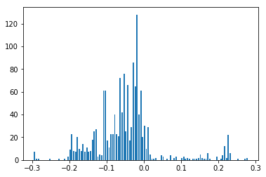
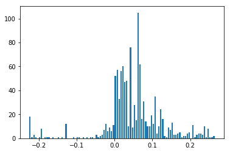
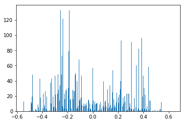
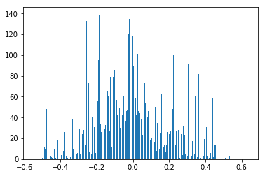
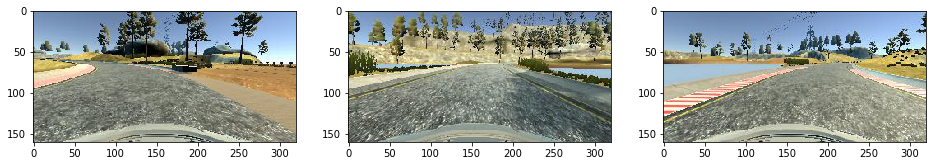
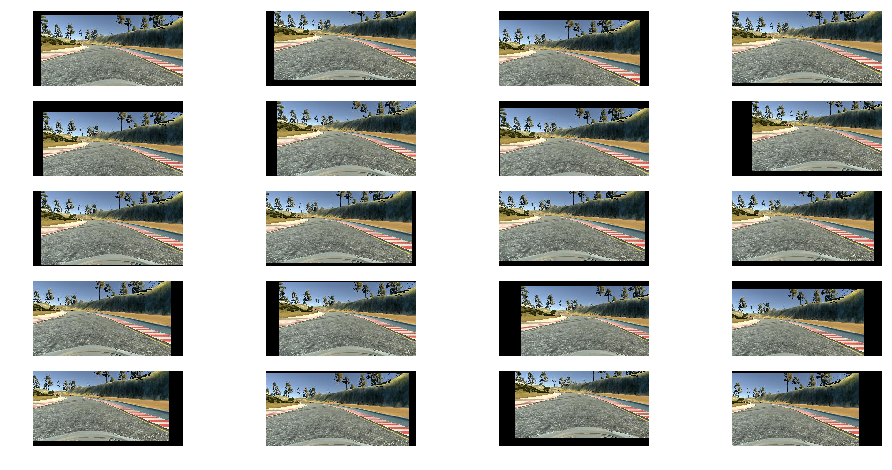

**Behavioral Cloning Project**

The goals / steps of this project are the following:
* Use the simulator to collect data of good driving behavior
* Build, a convolution neural network in Keras that predicts steering angles from images
* Train and validate the model with a training and validation set
* Test that the model successfully drives around track one without leaving the road
* Summarize the results with a written report


## Rubric Points
Here I will consider the [rubric points](https://review.udacity.com/#!/rubrics/432/view) individually and describe how I addressed each point in my implementation.  

---
Files Submitted & Code Quality

1. Submission includes all required files and can be used to run the simulator in autonomous mode

My project includes the following files:
* model.py containing the script to create and train the model
* drive.py for driving the car in autonomous mode
* model.h5 containing a trained convolution neural network 
* writeup_report.md or writeup_report.pdf summarizing the results

2. Submission includes functional code
Using the Udacity provided simulator and my drive.py file, the car can be driven autonomously around the track by executing 
```sh
python drive.py model.h5
```

3. Submission code is usable and readable

The model.py file contains the code for training and saving the convolution neural network. The file shows the pipeline I used for training and validating the model, and it contains comments to explain how the code works.

### Model Architecture and Training Strategy

1. An appropriate model architecture has been employed

- I followed the [nVidia architecture](https://devblogs.nvidia.com/parallelforall/deep-learning-self-driving-cars/) while adding my own dropouts between the fully connected layers.

2. Attempts to reduce overfitting in the model

 - As mentioned above, I added dropout (with 50% chance of dropping) between the fully connected layers.

3. Model parameter tuning

- The model used an adam optimizer, so the learning rate was not tuned manually (model.py line 210).

4. Appropriate training data

- Training data was chosen to keep the vehicle driving on the road. I used a combination of center lane driving, recovering from the left and right sides of the road. 

For details about how I created the training data, see the next section. 

### Model Architecture and Training Strategy

1. Solution Design Approach

- The architecture and design were failry straightforward. I used the nVidia architecture from the very beginning so there wasn't much exploration of other models done.
- The hardest part was debugging why my car wasn't behaving as I expected. This was largely due to data issues, discussed below.

2. Final Model Architecture

- I used the nvidia architecture with dropout between the fully connected layers.


3. Creation of the Training Set & Training Process

- This was the hardest part of the assignment for me. It was hard to determine what exactly why my car wasn't behaving as expected. For example: was it my model, my hyperparameters, my training data? It turned out to be a combination of the three, with the largest culprit being the training data.

- I initially recorded two loops driving the track normally, one loop of the track in the opposite direction (to generate more right turns) and one loop with some recovery/corrections.

- I asked my mentor for tips when my car kept driving into the water no matter what I tried. He suggested generating more sharp angles. With that in mind I plotted some data what my angles look like in each dataset I created.

The angles when driving normally:



The angles when driving the track in the opposite direction:



The angles for the recovery dataset:



And finally, everything combined:




I also used the recovery set to record "sharp turns". I wasn't actually turning, but instead, I found problematic points of the track and parked my car there and turned the wheel in the direction I wanted to go and recorded my car in that stationary position for a few seconds.

I used this approach to get through sharper turns and to also train my car to quickly turn away from curb/edge of the road should it find itself there.

I also plotted images with "sharper" angles to verify my expectations of driving direction were correct:



### Training

I split the data into training and validation datasets to start with.

For the training data I did some additional processing:

- I combined all the data sets together for taining. I also randomly dropped some datapoints with low steering angles since I still had a lot of datapoints going straight.

- The top 50 and bottom 20 pixels from each image are cropped to remove the sky and hood of the car.

- After cropping, the images are resized to 66hx200w to fit the nvidia model.

- I also created more sharp-turning angles by copying other sharp turns until the number of sharp turns equaled the number of soft turns. I defined sharp turns to be turns with an absolute steering angle greated than 3.5%.

- I applied random X,Y translations to images during training to account for different camera angles:



I used keras generators since I was running out of memeory otherwise.

Within the training generator I used the center, left, and right cameras for datapoints. I also applied a random translation in both the X,Y direction. Finally, I added a random flip to the center image.

Recording sharp turns proved to be the most useful strategy.


### Takeaways
- The assignment was probably the hardest yet because it's hard to debug why something isn't working.
- Learn about your data early in the process: I didn't plot my steering angles until after many days of debugging. If I would have been able to visualize the data sooner I think I would have noticed an imbalance of data and done some correcting.
- Debug the architecture with simple data. I ended up using a training set of three examples during the debugging process. I found a _small_ bug in the code this way, a simple multiplication by -1, which probably had a large impact on the performance of my model.
- Shell scripts are you friend. There was a lot of training on AWS and copying the model down to my local machine to test. Particularly: generate training locally -> copy to aws remotely -> train a new model remotely -> download the model locally -> run the simulartor -> back to generating more data. I wrote some shell scripts early on to automate most of this and it saved a lot of time.